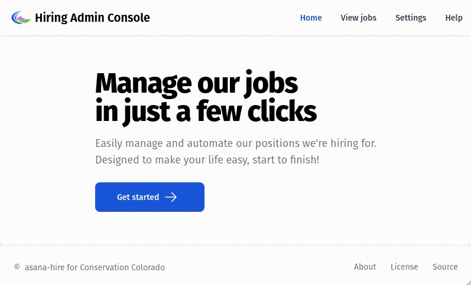

# Welcome!

This repository is home to `asana-hire`, an open source ([view license here](LICENSE)) recruitment management web
application designed for organizations that use Asana. This app is simple to use, lightweight, gives you insight into
your hiring process, and automates your administrative work. Read on to learn more!

## Quick demo

<div align="center">
  
  <p>Here's a quick demo of the application, including pages for individual jobs.</p>
</div>

### Background and motivation

I first started developing this application to do my job more efficiently at my organization. The tool started out as a
few simple Java classes I wrote to copy data from one place to another, run analytics, and send automated emails. As
we've adopted the tool at our organization, the application has necessarily grown from a set of command line tools to a
full stack site.

This application has administrator, hiring manager, and applicant users, with hundreds of monthly users. Since anyone
can apply to any open position at any time, and since hiring managers can review applications asynchronously, the
availability requirement is high. To achieve this availability, the application uses Asana as a data store.

Asana is not perfect for this use case. The graph model used under the hood there is slow to retrieve large amounts of
distributed information. This introduces latency to this application. However, Asana gives us a good balance of
usability of our staff. It also comes at no additional cost; we already use the tool, while would have to pay for a
managed database service. Also, we can easily export and report on data within Asana.

In short, Asana gives high availability and non-techie user-friendliness in exchange for additional latency when this
application is used manually. This is a worthwhile tradeoff for our use case!

### What it can do

- Track applicants across a single hiring process or across all processes
- Copy applicants from one Asana project to another while hiding sensitive data from the interview committee
- Send applicants personalized update emails, including receipt of application, release from process, or custom messages
- View anonymized hiring data in charts and graphs through Asana's reporting feature
- Secure all this data with organization-bound Google OIDC and OAuth2 user authentication and authorization
- [Run or deploy the application easily using Docker and Docker Compose](#run-or-deploy-the-application-with-docker-compose)
- [Separate your deployments with environment variables](#environment-variables)

# Getting started

### Get a copy of this repository

You'll want to get a local copy of everything in this repository. There are a few ways of doing this. You can use the
`git` command in your terminal, if you have it installed:

```shell
git clone https://github.com/OliverAbdulrahim/asana-hire.git
```

Alternatively, you can
[download a `.zip` file containing of the main branch at this link.](https://github.com/OliverAbdulrahim/asana-hire/archive/refs/heads/main.zip)

### Run or deploy the application with Docker Compose

Once you have the repository copied locally, you can run or deploy it using
[Docker Compose](https://docs.docker.com/compose/). Run the following `docker compose` command in your terminal:

```shell
docker compose --env-file <your env file> up
```

You may optionally include the `-d` flag to start the containers in detached mode (run in the background of your
terminal).

As an alternative to the command line, [Docker Desktop](https://docs.docker.com/compose/install/) has a user interface
you can use to run the application.

### Environment variables

To run the app, you'll need to supply the environment variables specified as _required_ below:

```shell
# Asana configuration
ASANA_ACCESS_TOKEN=                 # required: your Asana access token
ASANA_WORKSPACE_GID=                # required: the Asana global identifier for your workspace
ASANA_APPLICATION_PORTFOLIO_GID=    # required: the Asana global identifier for the portfolio containing your application projects
ASANA_INTERVIEW_PORTFOLIO_GID=      # required: the Asana global identifier for the portfolio containing your interview projects

# OAuth2 configuration
GOOGLE_CLIENT_ID=                   # required: your Google client ID, with the gmail.modify scope, limited to your organization
GOOGLE_CLIENT_SECRET=               # required: your Google client secret

# Base URL configuration
REACT_APP_CLIENT_URL=               # required: default is http://localhost:3000
REACT_APP_API_SERVER_URL=           # required: default is http://localhost:8080

# Database configuration
DB_URL=                             # required: your SQL database url
DB_USERNAME=                        # required: your SQL database username
DB_PASSWORD=                        # optional: your SQL database password

# Spring configuration
SPRING_PROFILES_ACTIVE=             # optional: a 'dev' profile is provided in this project
```

Store these in an `.env` file that you keep outside your repository. I've provided an [example.env](example.env) file
that you can use as a starter.

Create two different `.env` files to separate your production and development environments.

Alternatively, you can avoid using an `env` file altogether by passing each variable individually into your Docker
Compose command.
